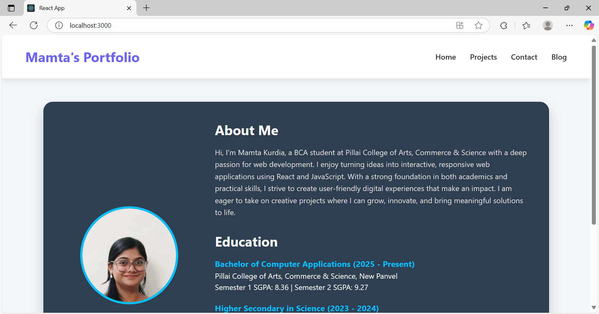
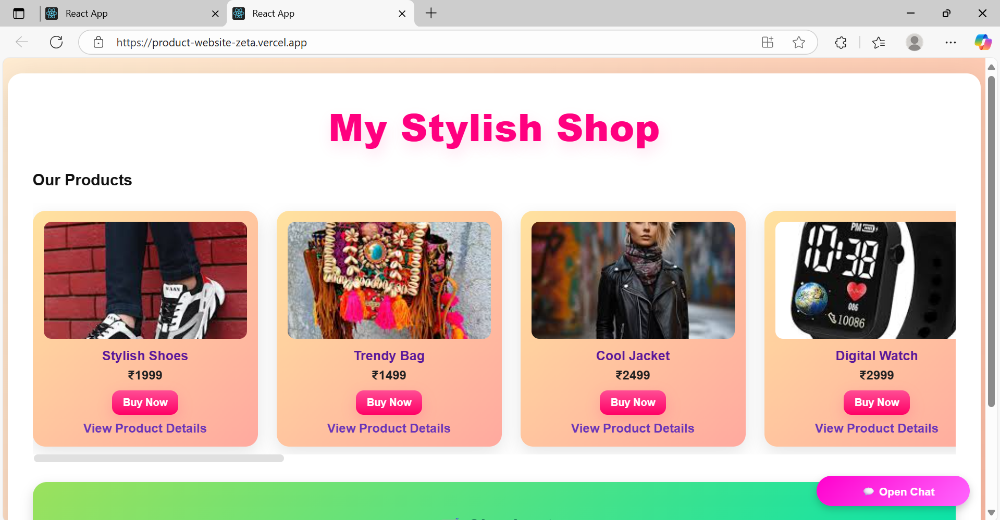
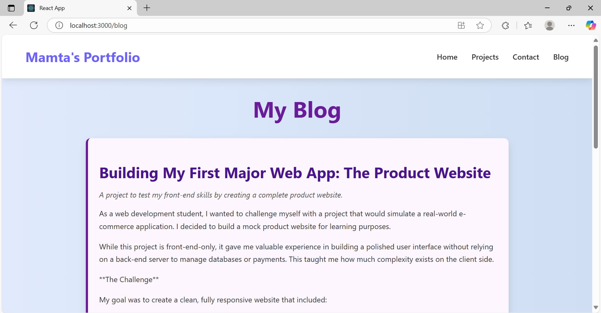
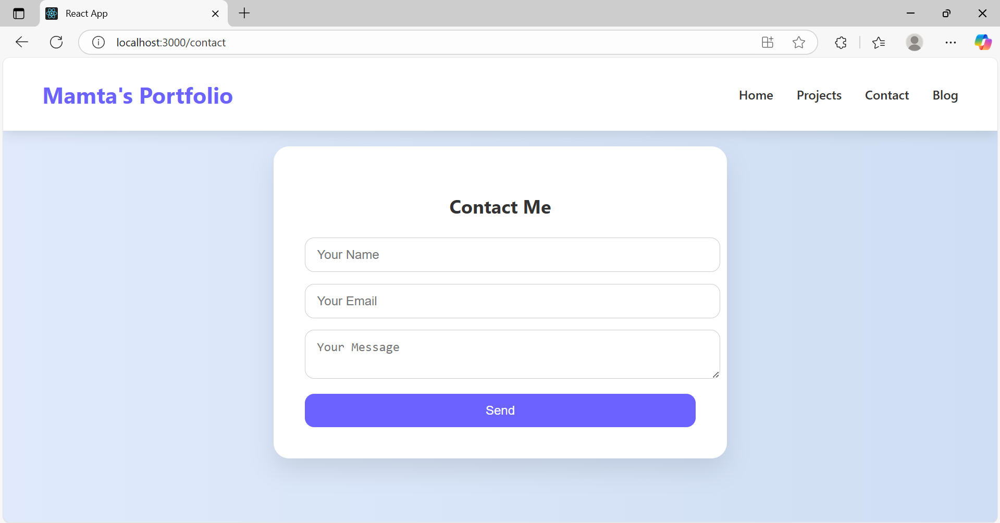

# My Portfolio Website

## Project Overview
This project is my **personal portfolio website** built using **React**. Its purpose is to showcase my skills, projects, and practical applications while demonstrating my ability to create a responsive, interactive, and professional front-end web application.

The portfolio includes:
- Home/Profile section  
- Portfolio/projects showcase  
- Full Stack Practical App (FSApp) integration  
- Blog section to share development experiences  
- Contact form  

---

## Features
1. **Navigation**  
   - Responsive navbar for easy navigation between pages (Home, Portfolio, Blog, Contact, FSApp).  

2. **Portfolio Section**  
   - Displays projects with filtering options (by type/domain).  
   - Links to live apps or project details.  

3. **Full Stack Practical App Integration**  
   - Embedded or linked app demonstrating a product website.  
   - Showcases front-end skills with dynamic product pages and cart simulation.  

4. **Blog Section**  
   - Posts detailing project experiences, learning outcomes, and development challenges.  
   - Blog can display multiple posts and individual content.  

5. **Contact Form**  
   - Simple form allowing visitors to reach out.  
   - Includes input validation and responsive styling.  

---

## Technology Stack
- **React**: Component-based architecture for building reusable UI components  
- **React Router**: Dynamic routing and navigation between pages  
- **React Hooks (`useState`, `useEffect`)**: State management for cart, blog content, and interactive features  
- **CSS (Flexbox & Grid)**: Fully responsive design  
- **Optional Libraries**:  
  - `react-markdown` (for blog posts, if using Markdown)  
  - JSON files or mock data for product information  

---

**Highlights:**  
- Components are reusable and maintainable.  
- State is managed at the component level and passed via props.  
- Routing is handled using React Router for SPA behavior.  

---

## Design Decisions
- **Component-based structure**: Easy scalability and code reuse  
- **Responsive UI**: Flexbox and CSS Grid ensure the website works on mobile, tablet, and desktop  
- **Interactive Features**: Shopping cart and product pages in FSApp demonstrate dynamic state handling  
- **Consistent Styling**: Color palette, typography, and spacing chosen for readability and aesthetic appeal  

---

## Screenshots

**Home Page:**  
  

**Projects Section:**  
  

**FSApp Page:**  
  

**Blog Page:**  
  

**Contact Form:**  
  

---

## React Features Used
- **useState**: For cart, toggles, and blog state management  
- **useEffect**: To simulate fetching data for products or posts  
- **Props**: Passing data between components (e.g., portfolio items, blog posts)  
- **React Router**: SPA navigation without page reloads  

---

## Future Enhancements
- Backend integration for real product data and cart functionality  
- Dynamic blog with Markdown or CMS integration  
- Animations and interactive UI elements to enhance user experience  
- Deployment optimization for faster load times  

---

## Conclusion
This portfolio website is a reflection of my web development skills, combining React, responsive design, and interactive components. It demonstrates my ability to structure a web application, manage state efficiently, and provide a smooth user experience.
